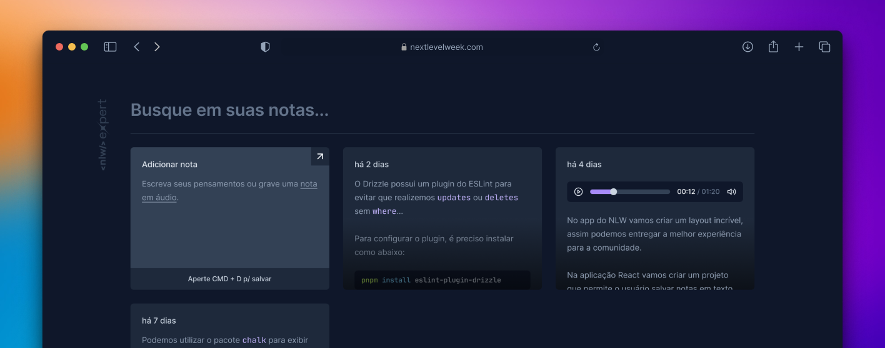

# ProdManager - Gerenciador de Produção

Aplicação moderna para gerenciamento de notas e tarefas de produção, desenvolvida com React, TypeScript, Tailwind CSS e SpeechRecognition API.

## 🚀 Funcionalidades

- **Gerenciamento de Notas**: Crie, edite e organize suas notas de produção
- **Busca Inteligente**: Busque rapidamente em todas as suas notas
- **Gravação por Voz**: Use a API de reconhecimento de voz para criar notas rapidamente
- **Calculadora Integrada**: Calculadora completa integrada ao sistema
- **Design Moderno**: Interface responsiva e intuitiva com identidade visual moderna
- **Armazenamento Local**: Todas as notas são salvas no navegador (localStorage)

## 🛠️ Tecnologias

- React 18
- TypeScript
- Tailwind CSS
- Vite
- Radix UI
- Lucide React
- date-fns
- SpeechRecognition API

## 📦 Instalação

Após clonar o repositório, acesse a pasta do projeto e execute os comandos abaixo:

```sh
npm install
npm run dev
```

## 🎨 Características

- Interface responsiva para mobile e desktop
- Tema escuro moderno com gradientes
- Animações suaves e transições
- Calculadora com operações matemáticas completas
- Sistema de notas com busca em tempo real

## 📝 Licença

Este projeto foi desenvolvido como parte do aprendizado de desenvolvimento web moderno.
